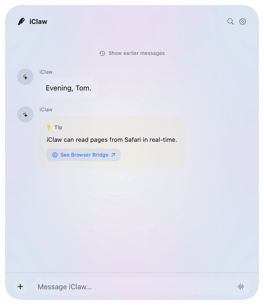
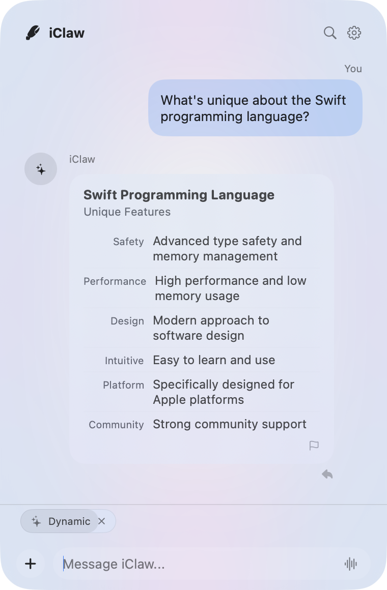
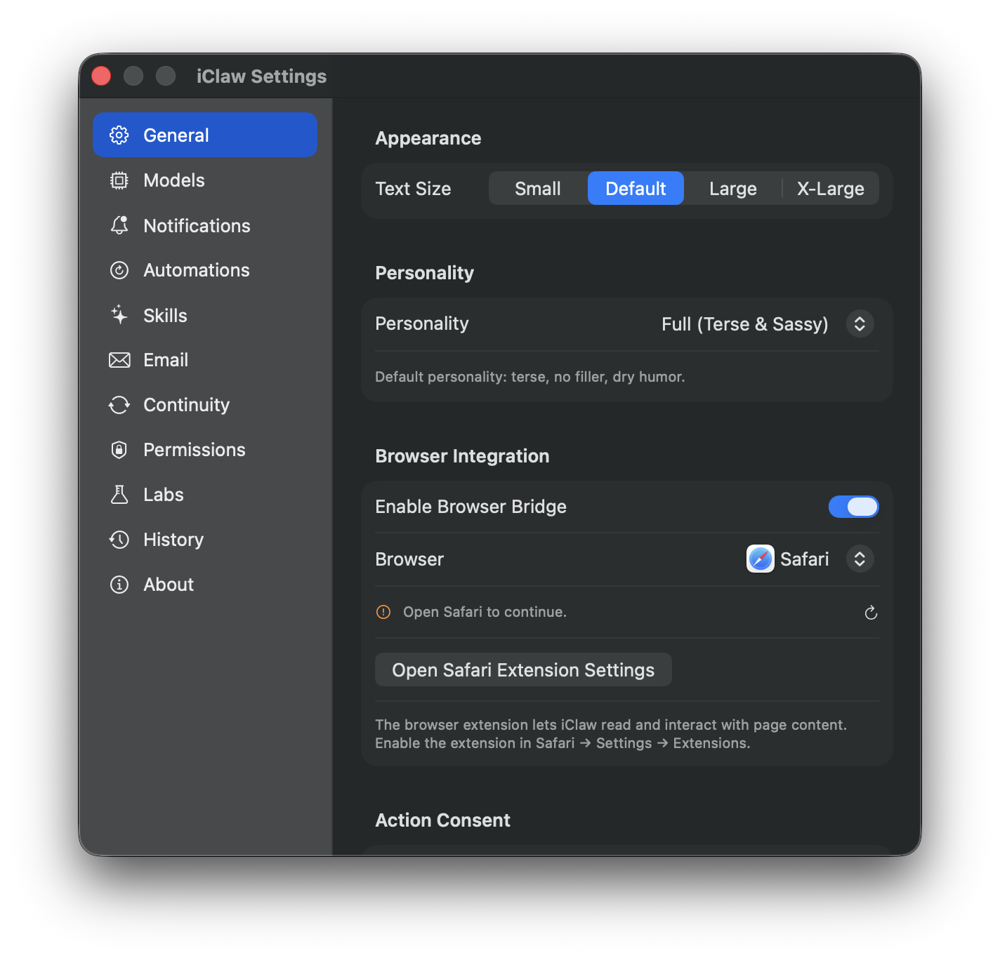

# iClaw

<p align="center">
  
</p>

<h1 align="center">iClaw</h1>

<p align="center">
  <strong>Free, local AI Agent for macOS and iOS 26+</strong><br />
  iClaw runs <i>on-device</i> using Apple Intelligence or Ollama
</p>

<p align="center">
  <a href="https://apple.com/macos"></a>
  <a href="https://swift.org"></a>
  <a href="https://github.com/LastByteLLC/iClaw/actions"></a>
  <a href="LICENSE"></a>
  <a href="http://makeapullrequest.com"></a>
</p>

<p align="center">
  <a href="https://geticlaw.com">Website</a> ·
  <a href="#features">Features</a> ·
  <a href="#tools">Tools</a>
</p>

---

**iClaw** is a local, native AI agent for macOS 26+ (and soon iOS 26+) written in Swift. It runs on-device using Apple Intelligence or Ollama. No usage limits, API keys, or subscriptions.

**Why iClaw?** iClaw envisions a helpful AI experience where you get the information you need using the hardware you already have, all without sacrificing your security or privacy.

| | |
| :---: | :---: |
|  |  |
| Podcast playback and research | Time, weather, and history |

iClaw lives in the menu bar as a floating Liquid Glass HUD, or optionally as a dock application.

## Benefits

* **Private**. All AI runs completely _on-device_, not in the cloud
* **Free**. No API keys, usage meters, or monthly subscriptions
* **Easy**. It's just an app, no custom models to configure
* **Green**. Use a fraction of the energy that cloud agents require
* **Open Source**. Free to review, contribute, or fork

## Features

| | | |
| :---: | :---: | :---: |
|  |  |  |
| Dynamic widget generation | Conversational follow-up | Settings and browser bridge |

* **100% On-Device** — All inference runs locally using Apple Intelligence or Ollama. Network is only used for fetching data (weather, web search, stock quotes).
* **Secure Design**.- iClaw lives in the App Sandbox and only has access to the tools, data, and accounts that you share with it.
* **Explicit Consent** — Destructive or non-reversible actions always require explicit user confirmation.
* **Extensible Skills** — Add your own skills to teach iClaw new capabilities.
* **4K Token Budget** — Every prompt component has an explicit token budget. The system is tuned to not exceed the on-device model's context window.
* **Progressive Memory** — Three-tier memory (working facts, running summary, vector archive) compresses, structures, and anchors recall for natural follow-ups.
* **Adaptive Routing** — ML classifier gates complexity: high confidence → fast single-tool path, medium → `@Generable` plan decomposition, low → multi-turn agent reasoning loop.
* **Multi-Step Agent** — Complex queries are decomposed into typed execution plans that the agent runner executes with inter-step reasoning.
* **ReAct Validation Loop** — Ingredients are validated for relevance. If a misroute is detected, the system re-routes with tool suppression.
* **LaTeX Rendering** — Mathematical expressions in LLM responses are detected and rendered natively via `SwiftMath`.
* **Soul-driven** — iClaw uses a (very concise) SOUL.md to generate a USER.md from interaction history.

## Roadmap (Coming Soon)

* [ ] **Mac App Store**: publish iClaw on the Apple App Store for macOS
* [ ] **iOS App**: run iClaw natively on any iPhone with Apple Intelligence, published on the Apple App Store for iOS
* [ ] **Continuity**: take iClaw on the go and automatically sync messages, files, and actions between Mac and iPhone
* [ ] **Learned Skills**: learn what actions you take repeatedly and turn these into repeatable, personalized Skills
* [ ] **Web Extensions**: access web pages and take actions on Chrome, Firefox, or Opera through web extensions similar to Safari
* [ ] **Email**: expand email support to any inbox, not just Mail.app. Support MailKit for automatic triage and categorization.
* [ ] **Dynamic Widget Catalog**: generate a catalog of well-designed slot-fill widgets to go beyond the wall of text

## Build Targets

| Target | Command | Output | Notes |
| --- | --- | --- | --- |
| Debug | `make build` | `.build/debug/iClaw.app` | Full entitlements (Apple Events + CloudKit) |
| Release | `make release` | `.build/release/iClaw.app` | Same entitlements, optimized |
| DMG | `make dmg` | `iClaw.dmg` | Direct distribution |
| Mac App Store | `make mas` | `iClaw.pkg` | MAS entitlements (no Apple Events), `-DMAS_BUILD` flag |
| iOS | `make build` | `iClawMobile.app` | iOS 26+ target |
| Tests | `make test` | — | 500+ tests, parallel-safe |
| Stress Test | `make stress-test` | `/tmp/iclaw_live_stress/` | 4-phase quality evaluation |

The MAS build uses `iClaw-MAS.entitlements` which excludes Apple Events and CloudKit. Tools that depend on AppleScript (i.e. AutomateTool, ReadEmailTool) are compile-time excluded via `#if !MAS_BUILD`. Other tools (SystemControl, Shortcuts) have MAS-compatible fallbacks using Core Audio, URL schemes, and `NSWorkspace`. Productivity tools (Calendar, Messages, Reminders, Notes, Contacts, Email) use a **soft-creation fallback** pattern: on permission denial or error, they show a preview widget with action buttons (e.g., "Add to Calendar" via .ics file, "Open in Messages" via sms: URL, "Add to Contacts" via .vcf vCard, "Copy & Open Notes" via clipboard).

## Tools

### Core Tools (deterministic execution, verified data)

| Tool | Platform | Description |
| --- | --- | --- |
| Weather | All | Current conditions, forecasts, comparisons via WeatherKit |
| Clock | All | Current time, world clock, timezone conversions |
| Timer | All | Countdown timers with notifications |
| Calendar | All | View events, date arithmetic, day-of-week queries |
| Calculator | All | Math, percentages, mortgages, tips. LaTeX in explanations |
| Compute | All | Sandboxed JavaScript execution for complex calculations |
| Convert | All | Unit and currency conversion via live exchange rates |
| Random | All | Dice, coins, playing cards, numbers, colors, dates |
| Stocks | All | Live quotes via Yahoo Finance with company name resolution |
| Maps | All | Location search, POI discovery, directions via MapKit |
| News | All | Headlines from 17+ RSS sources (BBC, Reuters, Ars Technica, etc.) |
| WikipediaSearch | All | Deterministic Wikipedia API lookups, verified data |
| Research | All | Multi-step web research with source citations |
| WebFetch | All | Fetch and compact content from any URL |
| Translate | All | On-device translation via Apple Translation |
| Podcast | All | Search and play podcasts |
| Transcribe | All | Speech-to-text from audio files |
| Email | All | Compose emails via mailto: with preview widget. Fallback: copy + open mail app |
| CalendarEvent | All | Create, list, edit, delete events via EventKit. Confirmation widget; .ics fallback on permission denial |
| Messages | All | Send iMessages (DMG: AppleScript, MAS: sms: URL). Preview widget; fallback to sms: URL + copy |
| Reminders | All | Add, list, complete, edit, delete via EventKit. Confirmation widget; fallback to Reminders.app + copy |
| Contacts | All | Search + create contacts via CNContactStore. Preview widget; .vcf vCard fallback on permission denial |
| Notes | macOS | Create, search, append via AppleScript (DMG) or clipboard (MAS). Confirmation widget; fallback to copy + Notes.app |
| Feedback | All | Submit feedback |
| Help | All | Usage help |
| Dictionary | macOS | Word definitions via DictionaryServices |
| SystemInfo | macOS | Battery, disk, CPU, RAM, WiFi, installed apps |
| Screenshot | macOS | Screen capture |
| TechSupport | macOS | Guided troubleshooting with system diagnostics |
| AutomateTool | macOS DMG | Run AppleScript with ReAct error correction |
| ReadEmail | macOS DMG | Read Mail.app inbox via AppleScript |

### FM Tools (LLM-called via Apple Foundation Models)

| Tool | Platform | Description |
| --- | --- | --- |
| web_search | All | DuckDuckGo + Brave web search |
| wikipedia | All | LLM-initiated Wikipedia lookups (fallback for Core WikipediaSearch) |
| clipboard | All | Read/write clipboard |
| read_file | All | Read file contents |
| shortcuts | All | Run Siri Shortcuts (MAS: URL scheme, DMG: AppleScript) |
| spotlight | macOS | Local file search via mdfind |
| system_control | macOS | Volume, dark mode, app launch/quit (MAS: Core Audio + NSWorkspace, DMG: AppleScript) |

### Skills (user-extensible, sandboxed)

Built-in: Books, Countries, Crypto, Emoji, Horoscope, Movies, Quote, Research, Rubber Duck, Tech Support.

## Architecture

### Execution Pipeline

Three execution paths based on query complexity:

```text
Input → Preprocessing (NER + Spellcheck) → ML Classifier
  ├── High confidence (≥0.90) → FAST PATH: Single tool → Widget → Output
  ├── Medium (0.35–0.90) → PLANNING: @Generable plan → Sequential execution → Output
  └── Low (<0.35) → AGENT: Multi-turn reasoning loop with domain-scoped tools → Output
```

The fast path preserves the existing low-latency pipeline for simple queries ("what's the weather"). The planning path uses `@Generable` structured output for type-safe tool decomposition. The agent path enables multi-step reasoning for complex queries ("book a walking lunch with Sarah the next sunny day").

### Routing Pipeline

1. Attachment hint (file type detection)
2. Follow-up detection (3-layer: slots, ML, NLP)
3. Tool chips (`#weather`, `#stocks`, etc.)
4. Ticker symbols (`$AAPL`)
5. URL detection
6. Skill matching
7. Synonym expansion
8. ML classification (MaxEnt CoreML)
9. Heuristic overrides (entity-aware suppression for Calculator/Convert/Random/SystemInfo/Stocks)
10. LLM fallback
11. Conversational

### Dynamic Widgets

Tools return raw data as ingredients. When no tool widget is returned, a separate LLM call generates a visual layout using a pipe-delimited DSL:

```text
H|title|subtitle            — Header
S|value|label               — Hero stat
SR|val1;label1|val2;label2  — Stat row
KV|key|value                — Key-value pair
L|title|subtitle|trailing   — List item
TB|col1|col2|col3           — Table header
TR|val1|val2|val3           — Table row
```

Widgets are validated post-generation: placeholder values removed, single-block widgets rejected, table units hoisted to headers, minimum content thresholds enforced.

### Spellcheck

Three-layer guard prevents overcorrecting brand names and proper nouns:

1. **Capitalization** — Mid-sentence capitalized words are skipped
2. **NER adjacency** — Words near NER-identified entities are protected
3. **Common word filter** — Corrections accepted only toward top-5000 English words

### Memory

Three-tier progressive memory within the 4K token budget:

* **Tier 1 — Working Facts** (5 slots, ~50 tokens): Structured facts from tool results, scored by recency + entity overlap
* **Tier 2 — Running Summary** (~80 tokens): Incremental LLM fold of evicted facts
* **Tier 3 — Vector Archive**: NLEmbedding cosine similarity for long-term semantic retrieval

## LoRA Adapter

iClaw previously shipped a LoRA adapter on top of Apple's on-device Foundation Models. The adapter has been removed and is not wired up pending resolution of [this Apple Developer Forums thread](https://developer.apple.com/forums/thread/823001). Until that issue is resolved, iClaw runs against the base `SystemLanguageModel` without an adapter.

## Getting Started

Requires macOS 26+ (or iOS 26+) with Apple Intelligence enabled.

```bash
make build     # Debug build
make run       # Build + open
make test      # Run all tests
```
